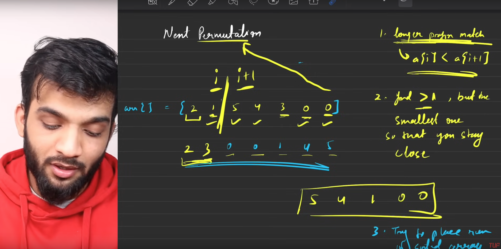

# 31. Next Permutation
A permutation of an array of integers is an arrangement of its members into a sequence or linear order.

    For example, for arr = [1,2,3], the following are all the permutations of arr: [1,2,3], [1,3,2], [2, 1, 3], [2, 3, 1], [3,1,2], [3,2,1].

    For example, the next permutation of arr = [1,2,3] is [1,3,2].
    Similarly, the next permutation of arr = [2,3,1] is [3,1,2].
    While the next permutation of arr = [3,2,1] is [1,2,3] because [3,2,1] does not have a lexicographical larger rearrangement.

``` Given an array of integers nums, find the next permutation of nums.

The replacement must be in place and use only constant extra memory.

Example 1:

Input: nums = [1,2,3]
Output: [1,3,2]

Example 2:

Input: nums = [3,2,1]
Output: [1,2,3]

Example 3:

Input: nums = [1,1,5]
Output: [1,5,1]
```



```python
we can find the next permutation by following these steps:
1. find the breaking point, which is the first index i from the end of the array such that nums[i] < nums[i + 1]. If no such index exists, it means we are at the last permutation, so we reverse the entire array to get the first permutation.
2. find the smallest number in the suffix (the part of the array after the breaking point) that is just greater than nums[i]. This will be the number we swap with nums[i].
3. swap nums[i] with the number found in step 2.
4. reverse the suffix to get the next permutation.
```


## But why we are we doing this, traversing the array from the end to the beginning?
The reason we traverse the array from the end to the beginning is that we want to find the first pair of elements that are in increasing order. This indicates that we can make a swap to create a larger permutation. By starting from the end, we can quickly find this pair and then work our way back to find the next permutation.


```cpp
class Solution {
public:
    void nextPermutation(vector<int>& nums) {
        int breakpoint = -1;
        for(int i=nums.size()-2;i>=0;i--){
            if(nums[i] < nums[i+1]){
                breakpoint = i;
                break;
            }
        }
        if(breakpoint==-1){
            reverse(nums.begin(),nums.end());
            return;
        }

        // Find the next greater element, as the suffix is sorted in descending order then the first element which is greater than nums[breakpoint] will be the next greater element
        // We can do this by traversing the suffix from the end to the beginning
        for(int i=nums.size()-1;i>breakpoint;i--){
            if(nums[i] > nums[breakpoint]){
                swap(nums[breakpoint],nums[i]);
                break;
            }
        }

        // Reverse the suffix to get the next permutation
        // The suffix is sorted in descending order, so if we reverse it, it will be sorted in ascending order, because the next permutation is the smallest permutation that is greater than the current permutation
        reverse(nums.begin()+breakpoint+1,nums.end());
    }
};
```

Tc: O(n)
Sc: O(1)
