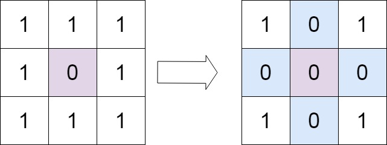

# 73. Set Matrix Zeroes

Given an m x n integer matrix matrix, if an element is 0, set its entire row and column to 0's.

You must do it in place.



```cpp
class Solution {
public:
    void setZeroes(vector<vector<int>>& matrix) {

        vector<bool> row(matrix.size(),0);
        vector<bool> col(matrix[0].size(),0);

        for(int i=0;i<matrix.size();i++){
            for(int j=0;j<matrix[0].size();j++){
                if(matrix[i][j]==0){
                    row[i] = true;
                    col[j] = true;
                }
            }
        }

        /* for(int i=0;i<row.size();i++){
            cout<<row[i]<<" ";
        }
        cout<<endl;

        for(int i=0;i<col.size();i++){
            cout<<col[i]<<" ";
        }
        cout<<endl; */

       for(int i=0;i<matrix.size();i++){
            for(int j=0;j<matrix[0].size();j++){
                if(row[i]==true || col[j]==true) matrix[i][j]=0;
            }
        }
    }
};
```

